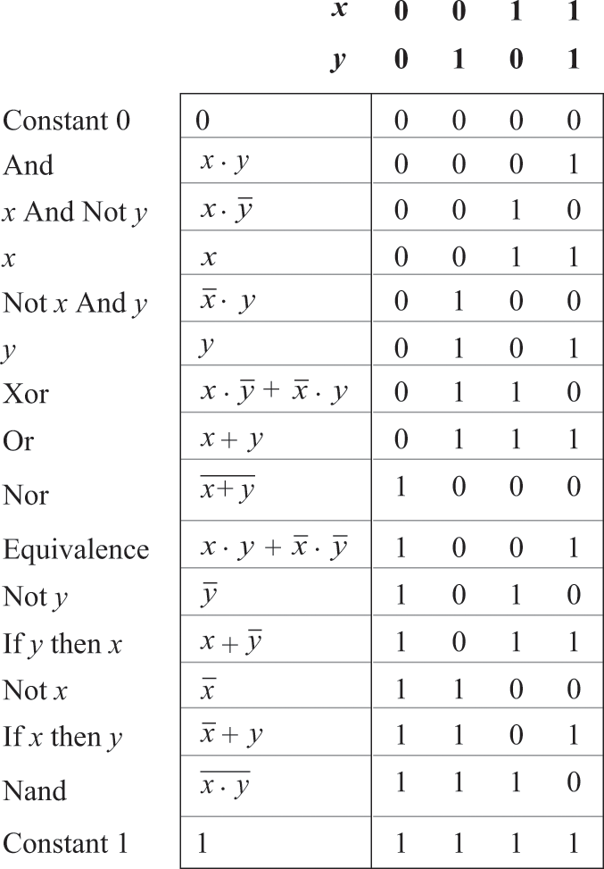

- All digital devices utilize chips to store and process binary information, all fundamentally built upon consistent elementary logic gates, irrespective of the diverse hardware implementations.

## Boolean Algebra
- Boolean algebra handles two-state binary values, labelled as 1 and 0
- A Boolean function operates on these binary inputs and returns binary outputs
- The most basic of these functions are **AND, OR and NOT**
- These basic functions can be combined to make more complicated ones - **NAND, NOR and XOR**
- Furthermore, it can be said that any of the three basic functions can be expressed using only **NAND** gates ( or **NOR** )
	- This means that ***EVERY*** Boolean function can be expressed solely in terms of **NAND** gates

### AND
- This operator gives the result true if both operands are true
- Expressed as: $$ A \cdot B $$
### OR
- This operator gives the result true if EITHER operands are true
- Expressed as: $$ A + B $$
### NOT
- This operator gives the result true if the operand is false
- Expressed as: $$ \overline{A} $$
  ### NAND
  - This operator returns true if at least one of the operands is false
  - Expressed as:$$ \overline{A \cdot B} $$
### NOR
- This operator returns true only of both operands are false
- Expressed as: $$ \overline{A + B} $$
### XOR
- This operator returns true if only 1 operand is true and the other is false
- Expressed as: $$ (A \cdot \overline{B}) + (\overline{A} \cdot B) $$
### Others
- A full list of functions can be found here:

- A truth table is a convenient means for describing states, whereas a Boolean expression is a convenient form for realising this description as singular logic

## Canonical Form
- Used to express a Boolean function in terms of And, Or and Not
- Seen in the initial x, y column in the image above

### Sum of Product
1. Find lines with out = 1
2. Write inputs as a product of each other
	1. If the input is 0, write a bar above it
3. Repeat step 2 for each remaining line with out = 1
4. Sum each of these products together

##### Example
## Truth Table

## Sum of Product

### Product of Sum
1. Find lines with out = 0
2. Write inputs as sum of each other
	1. if input = 1, write with bar above
3. Repeat step 2 for every line with out = 0
4. Take product of each of the sums
##### Example
## Truth Table

## Product of Sums

### Karnaugh Map
- Simplified version
- Not covered in this course